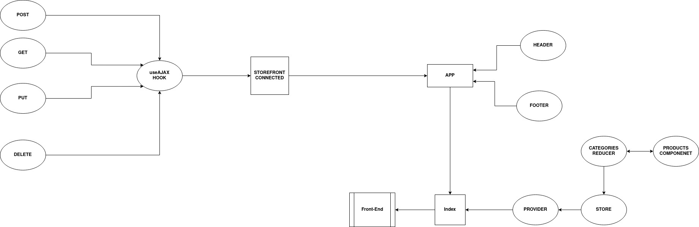
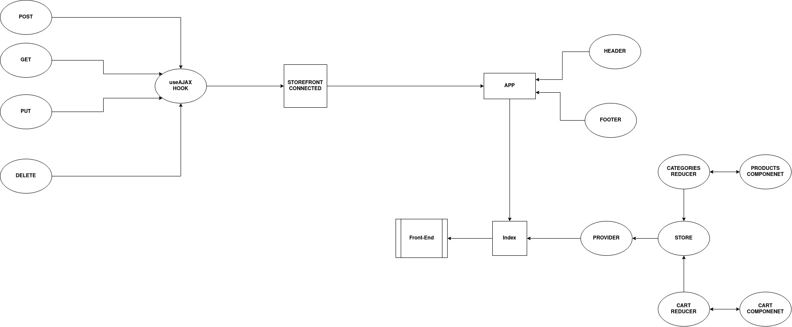
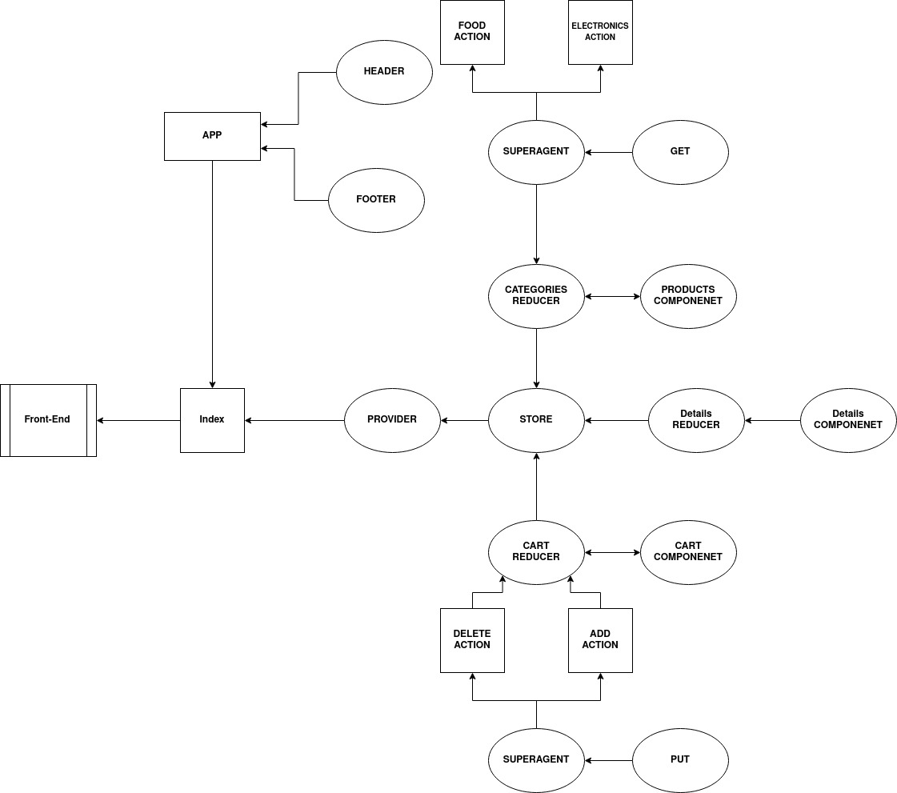

# storefront

## Author

Amjad Mesmar

## About

An e-commerce web application that let user search for their needed product based on the category, add it to cart and buy it, this app use ReactJs and  Redux technologies.

## Links

[Repository](https://github.com/AmjadMesmar/storefront)
[Pull Request](https://github.com/AmjadMesmar/storefront/pull/4)
[Deployed App](https://souls-storefront.netlify.app/)

## UML Diagrams

### Redux Storefront UML Diagram

### Storefront Multi-Reducers UML Diagram

### Storefront Thunk UML Diagram2

